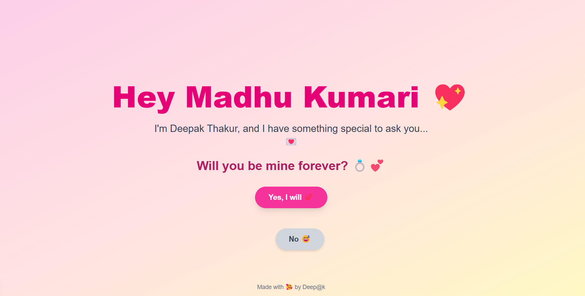

# 💖 Madhu Proposal App 💍

A fun, romantic, and slightly silly web app where Deepak proposes to Madhu with style, sparkles, and surprises 🎉  
Built using **Next.js**, **Tailwind CSS**, and a sprinkle of ❤️.

---

## 🌐 Live Demo

👉 [Click here to view it live on Vercel!](https://madhu-proposal-eza2.vercel.app/)

---

## ✨ Features

- 💌 A heartfelt message for Madhu Kumari
- 💍 A sweet proposal with a "Yes" and a runaway "No" button (because saying no isn’t an option 😜)
- 🎉 Confetti celebration when she says YES!
- 🌈 Beautiful gradients and smooth animations
- 😂 Interactive fun — try to click "No" 😉

---

## 🛠️ Built With

- [Next.js](https://nextjs.org/)
- [React](https://reactjs.org/)
- [Tailwind CSS](https://tailwindcss.com/)
- [react-confetti](https://www.npmjs.com/package/react-confetti)

---

## 📸 Preview


<!-- You can upload your screenshot and replace the link above -->


---

## 🚀 Getting Started

### Prerequisites

- Node.js
- npm (or yarn)

### Installation

1. **Clone the repository**
   ```bash
   git clone https://github.com/deep-coder1/madhu-proposal.git
   cd madhu-proposal
